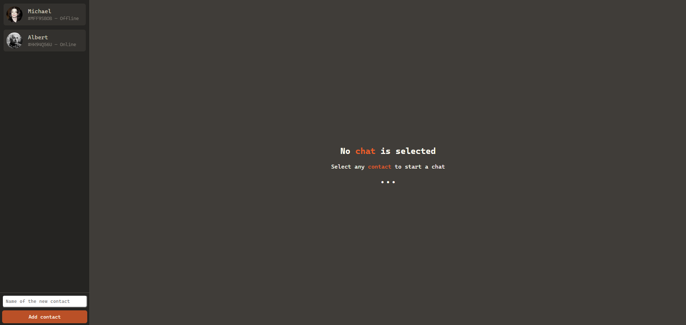
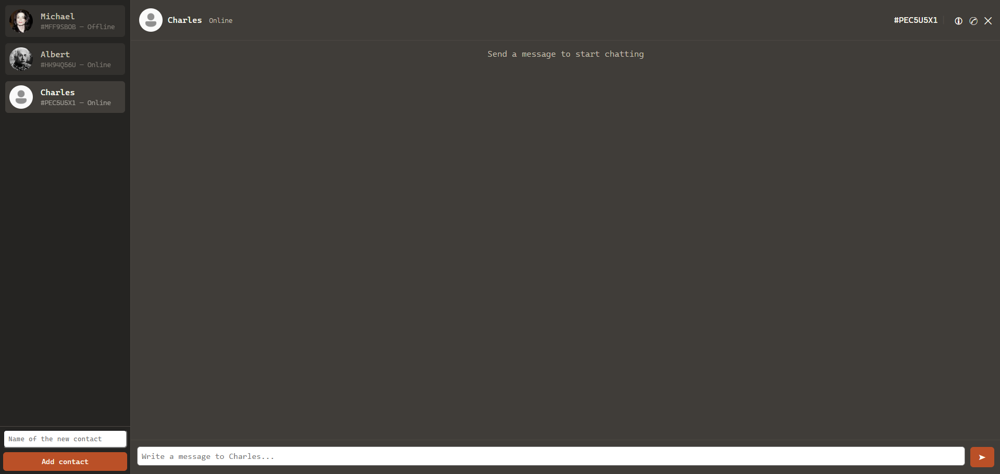
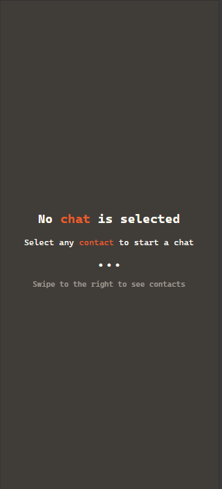
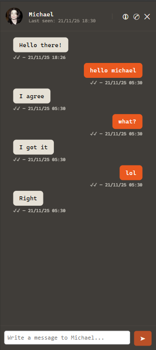
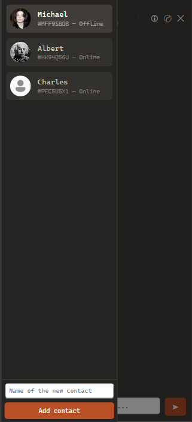

# Clon de Aplicación de Chat en React JS

## Descripción
Este proyecto es un clon funcional de una aplicación de chat, desarrollado con React JS y CSS nativo, como Trabajo Final Integrador del curso.
El objetivo principal fue practicar el manejo de componentes, estado, props, eventos, y renderizado condicional, aplicando todo lo aprendido en la cursada.

La aplicación simula una interfaz de chat con lista de contactos, historial independiente por conversación y envío/recepción de mensajes.

## Cómo usar

### Opción A:
Ingresar a https://diplofullstack-tp-final-react.vercel.app/

### Opción B:
1. Clonar el repositorio:
      ```bash
      git clone https://github.com/BrunoBoccasile/diplofullstack_tp_final_react.git
2. Instalar dependencias:
      ```bash
      npm install
3.  Ejecutar el proyecto:
      ```bash 
      npm run dev
## Funcionalidad

### Panel lateral izquierdo (lista de contactos).

- Muestra todos los chats disponibles.
- Permite agregar nuevos contactos mediante un formulario validado (no acepta texto vacío).
- En dispositivos móviles, el panel funciona como menú deslizable, que puede abrirse mediante swipe
- Cada contacto incluye:
   - Foto de perfil
   - Nombre
   - Estado (online, offline)


### Panel principal derecho (ventana de chat)
- Muestra el historial de mensajes del chat seleccionado, de forma independiente por contacto.
- Cada mensaje se muestra en una burbuja:
   - Usuario: alineado a la derecha
   - Contacto: alineado a la izquierda
- Los mensajes enviados se agregan al instante.
- El sistema responde automáticamente con un mensaje simulado tras un retardo.
- Incluye input para escribir mensajes nuevos.
### Comportamiento responsive
- En pantallas grandes se muestran ambos paneles.
- En móviles:
   - Solo se muestra un panel a la vez.
   - El panel izquierdo aparece mediante swipe to the right.
   - Se muestra un mensaje “Swipe to the right to see contacts” cuando no hay chat seleccionado.


## Conceptos aplicados

- Componentes reutilizables (ChatList, ChatDetail, MessagesList, CreateNewMessage, etc.)
- useState y useEffect para manejar UI, lógica del chat y estados globales.
- Context para compartir contactos y chat actual entre componentes.
- Eventos táctiles (touchstart, touchmove) para detectar gestures en mobile.
- Validaciones básicas en formularios.
- Renderizado condicional.
- Manejo de listas dinámicas con keys.
- Diseño con CSS nativo, Flexbox y media queries.

## Estilos y diseño
- Estilos implementados completamente con CSS nativo.
- Uso intensivo de Flexbox para paneles, listas y burbujas de mensajes.
- Animaciones simples:
   - Carga tipo spinner
   - Texto con puntos suspensivos animados cuando no hay chat seleccionado
- Paleta basada en tonos oscuros con contraste naranja (#EB5E28).
- Diseño de interfaz de usuario tipo Terminal-style

## Capturas de pantalla








## Créditos
- Autor: Bruno Boccasile
- Curso: React JS 
